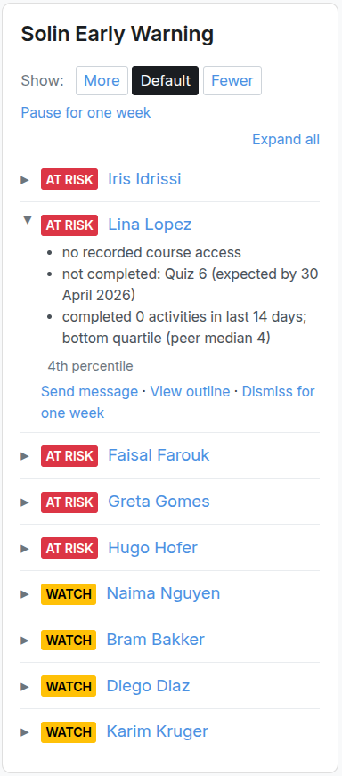
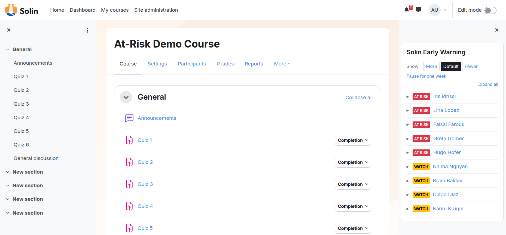
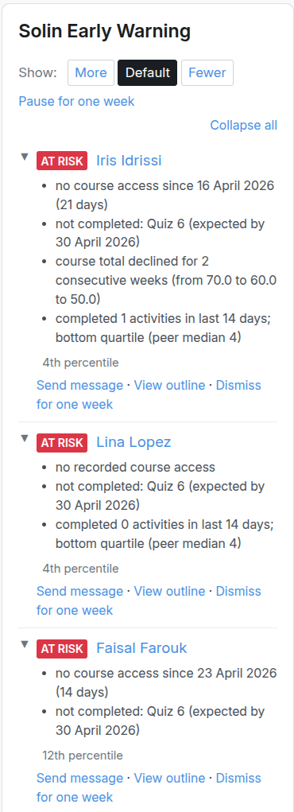
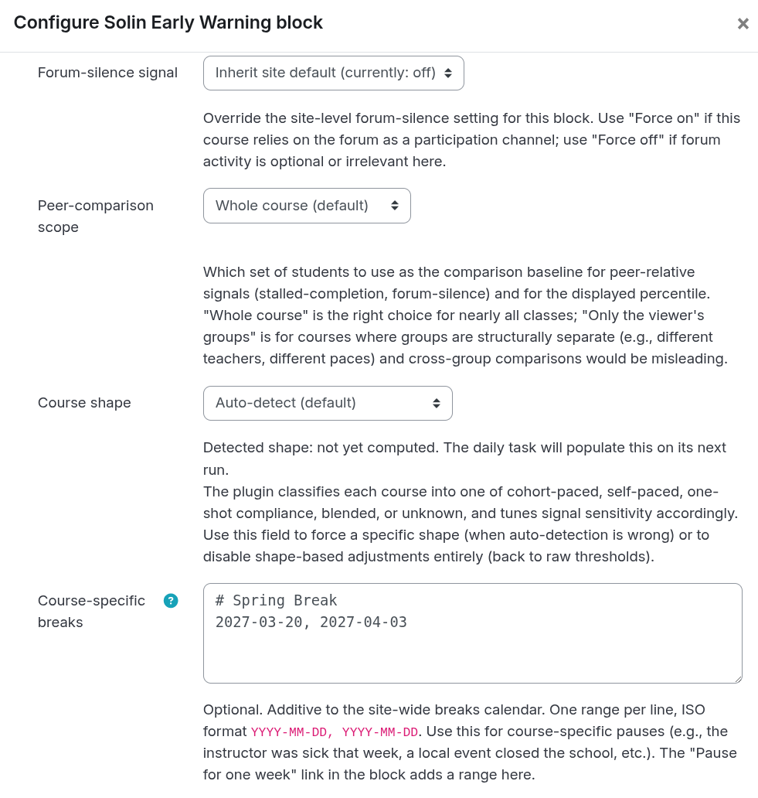
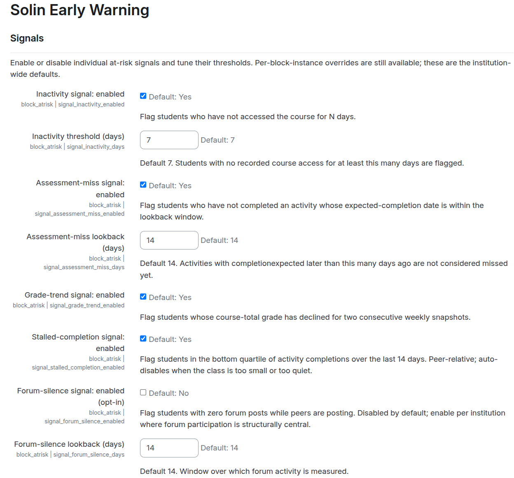
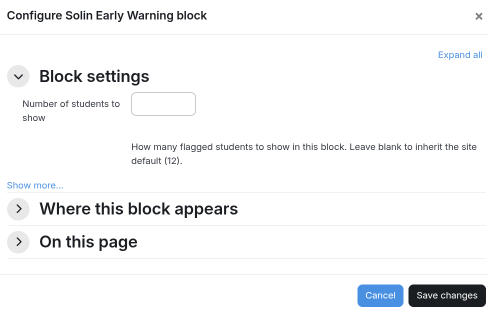

# Solin Early Warning (`block_atrisk`)

A Moodle block that surfaces, in a teacher's course view, a ranked list
of students at risk of disengagement. Multi-signal heuristics over data
Moodle already collects. No machine-learning backend, no email blast, no
analytics tool dependency.



## Compatibility

| Moodle | PHP | Database | Branch |
|---|---|---|---|
| 5.2 | 8.3+ | PostgreSQL, MySQL 8, MariaDB | `main` |
| 5.1 | 8.2+ | PostgreSQL, MySQL 8, MariaDB | `MOODLE_501_STABLE` |
| 4.5 LTS | 8.1+ | PostgreSQL, MySQL 8, MariaDB | `MOODLE_405_STABLE` |

## Installation

Pick the branch / ZIP that matches your Moodle version:

| Moodle | Tag pattern |
|---|---|
| 5.2 | `v{X.Y.Z}-MOODLE_502_STABLE` |
| 5.1 | `v{X.Y.Z}-MOODLE_501_STABLE` |
| 4.5 LTS | `v{X.Y.Z}-MOODLE_405_STABLE` |

**Via the admin UI:** download the ZIP for your Moodle version from the
[releases page](https://github.com/solin-repo/moodle-block_atrisk/releases),
then *Site administration → Plugins → Install plugins*, drop the ZIP,
confirm.

**Via git:** clone the matching branch directly into the webroot:

```bash
cd /path/to/moodle/blocks
git clone -b MOODLE_502_STABLE https://github.com/solin-repo/moodle-block_atrisk.git atrisk
```

(For Moodle 4.5 LTS use `MOODLE_405_STABLE`; for 5.1 use
`MOODLE_501_STABLE`. The directory name on disk must be `atrisk`, not
`moodle-block_atrisk`.)

Then visit *Site administration → Notifications*, or run
`php admin/cli/upgrade.php`, to install the plugin and create its
tables. Once installed, turn editing on inside any course and add the
*Solin Early Warning* block from the block picker.

## What teachers see

The block sits in the course-view sidebar, visible only to users with
the view capability (default: editing teachers, non-editing teachers,
managers). Students never see it.



By default each row is collapsed, showing severity, name, and the
optional *Tentative* badge during the calibration window. Click a row
or use the **Expand all** toggle to see the per-signal reasons, the
worst-percentile, and the action links.



### Action links

Each expanded row offers up to three actions, plus a block-wide pause
control in the header:

- **Send message** — opens Moodle's standard messaging UI with the
  student pre-selected (`/message/index.php?id={userid}`). Requires the
  `block/atrisk:messagestudent` capability and the platform's standard
  messaging capabilities on the target user.
- **View outline** — links to the per-student course outline at
  `/course/user.php?id={courseid}&user={userid}`, which lists the
  student's recent activity, completion state, and grade entries
  inside the course. Useful as a one-click drill-down before
  intervening.
- **Dismiss for one week** — hides the flag from the list for **7
  days**. Stored as a row in `block_atrisk_dismissals` keyed on
  `(courseid, userid)` and applied across every block instance in the
  course (so dismissing in one block instance also clears it from
  another instance in the same course). An **Undo** link appears
  inline on the same render so an accidental click is one-click
  recoverable. Dismissal also captures the signals firing at click
  time (`signals_at_dismissal` JSON: signals, severity, preset) for
  end-of-term false-positive analysis. Requires
  `block/atrisk:dismissflag`.
- **Pause for one week** (block header, users with
  `block/atrisk:configureblock`) — appends `today, today+6d` to the
  per-instance breaks list, suppressing the entire block until the
  range expires. The header link toggles to **Resume now** while the
  range is active. See *Holidays and term breaks* for the underlying
  mechanism.

## Signals

Each signal evaluates one observable behavior and either fires or
doesn't for a given student.

| Signal | Fires when | Default scope |
|---|---|---|
| **Inactivity** | Days since the student's last access to *this course* exceeds the threshold. Site-level access doesn't count. | 7 days |
| **Assessment-miss** | A completion-tracked activity whose `completionexpected` date fell within the lookback is still INCOMPLETE for the student. | 14-day window |
| **Negative grade-trend** | The student's weekly course-total grade has declined for two consecutive weeks. Requires three weekly snapshots. | Always on once snapshots accumulate |
| **Stalled completion** | The student's count of completed activities in the lookback sits in the bottom quartile of their peer group (the actively-enrolled students in the same course). | 14 days |
| **Forum silence** *(opt-in)* | The student has zero forum posts in the lookback while the class median is at least one. | 14 days; disabled by default |

The forum-silence default is set under *Site administration → Plugins →
Blocks → Solin Early Warning*. Individual block instances can override
the default (Inherit / Force on / Force off).

## Severity tiers

- **Yellow ("Watch")** — exactly one signal fired.
- **Red ("At risk")** — two or more signals fired.

A student with zero firing signals does not appear in the list.

## List order

The block ranks the most-at-risk student first. Tiebreakers, in
priority:

1. **Severity** (red before yellow).
2. **Number of signals firing** (more is worse).
3. **Worst peer-percentile** — the lowest percentile among the student's
   firing signals. Lower percentile = more at risk relative to peers in
   the same course. The percentile direction is normalised per signal
   so "5th percentile" always reads as "worse than 95% of peers"
   regardless of whether the underlying metric is high-is-bad or
   low-is-bad.
4. **Lastname / firstname**, only for fully-tied rows.

The list cuts off at the top-N (site default 12, overridable per block
instance). Remaining flagged students sit behind a "View all" link.

## Calibration window

Signals don't fire blindly on a brand-new course. The output you see
evolves over the first month of activity:

| Course week | Phase | What you see |
|---|---|---|
| 1–2 | **Gated** | Only the *no-course-access-at-all-yet* form of inactivity fires. The block shows the calibrating banner: *"Heuristics are calibrating — full signals activate from week 3."* |
| 3–4 | **Tentative** | All enabled signals run. Each flagged row is marked with a small *Tentative* badge alongside the severity colour, signalling that the signal histories are still short and the flags should be weighted accordingly. |
| 5+ | **Confident** | No badge. Signals are at full strength. |

Course week count is reckoned from `course.startdate`. For courses with
no start date or with rolling enrolment, the per-student timeline is
reckoned from `mdl_user_enrolments.timestart` (the user's enrolment
activation), falling back to `timecreated`. The window length is
configurable site-wide (default 2 weeks gated, 2 weeks tentative).

The block also auto-disables peer-relative signals when the course has
fewer than **10** active enrolments (hard floor) and warns when the
count is between 10 and 19 (soft floor). "Active enrolment" means
students with an active, non-suspended course enrolment — unrelated to
the Moodle **cohort** entity (`mdl_cohort` / *Site administration →
Users → Cohorts*), which this block does not use.

## Groups

The block respects Moodle's group mode:

- **No groups / Visible groups**: every teacher with the view
  capability sees the full list.
- **Separate groups + viewer has *Access all groups***: same — managers
  and similarly-privileged teachers see everyone.
- **Separate groups + viewer lacks *Access all groups***: the rendered
  list is filtered to students in the viewer's own groups. If the
  viewer is in zero groups in this course, the block shows a distinct
  empty state.

**Statistics scope** is independent of the visibility filter:

- **Whole course (default)**: peer-relative signals and the displayed
  percentile are computed against all course participants.
- **Only the viewer's groups**: per-instance override for courses where
  groups are structurally separate (different teachers, different
  paces). Set under "Show more…" in the block edit form.

## Holidays and term breaks

Break periods are subtracted from the engine's calculations. During a
break the block shows a paused banner; after a break, the engine
dampens metrics so students aren't flagged for inactivity or missed
work that happened over a holiday.

**Site-wide calendar** — set once for the institution under *Site
administration → Plugins → Blocks → Solin Early Warning → Breaks
calendar*. Format: one break per line, ISO dates, `YYYY-MM-DD,
YYYY-MM-DD`. Lines starting with `#` are comments. Example:

```
# 2026/2027 academic year
2026-10-13, 2026-10-19
2026-12-22, 2027-01-04
2027-02-23, 2027-03-01
2027-04-27, 2027-05-08
2027-07-13, 2027-08-23
```

**Course-specific breaks** — each block instance has its own optional
`course_breaks` field, additive to the site calendar. Format is the
same. Use it for ad-hoc pauses that don't apply institution-wide.



**While a break is active**: the block shows an informational banner
above the list — *"Currently in a configured break (until 7 January
2027). The list reflects pre-break activity; break time is excluded
from the calculations."* The list itself stays visible so a teacher
preparing for resumption can see pre-break flags.

**After a break**, the engine subtracts the break's overlap from each
signal's lookback:

- **Inactivity** doesn't count idle time spent on holiday. A student
  last seen the day before Christmas, returning January 8, is not
  flagged at the default 7-day threshold.
- **Forum-silence** and **stalled-completion** lookbacks are extended
  backward by the break duration so the window reaches pre-break
  activity.
- **Assessment-miss** does the same and additionally suppresses
  activities whose `completionexpected` falls inside a break.
- **Grade-trend** is naturally self-correcting — break-week snapshots
  have no change to compare against.

A small note appears above the list ("Break dampening: 14 days of
recent break time excluded") whenever past breaks are affecting the
current render.

**"Pause for one week" link** — for users with `configureblock`, an
inline link in the block header appends `today, today+6d` to the
per-instance break list. **"Resume now"** in the active-break banner
removes any per-instance range that currently includes "now";
site-level ranges keep applying. Both links carry tooltips describing
the action and its scope.

**Retroactive entry** — entering past dates in either calendar dampens
the next render's metrics, so a teacher returning from a forgotten
pause can fix the false-positive flood in one form save.

## Configuration

### Site-wide settings

*Site administration → Plugins → Blocks → Solin Early Warning.*



The page is grouped into sections:

- **Per-signal enable / threshold** — turn each signal on or off and
  set its default threshold (inactivity days, assessment-miss
  lookback, forum-silence lookback). The grade-trend and
  stalled-completion signals have no numeric threshold — they fire on
  consecutive-decline and bottom-quartile respectively.
- **Cohort floors** — the hard floor (default 10) and soft floor
  (default 20) for active enrolments, controlling when peer-relative
  signals auto-disable or carry the small-class caveat.
- **Calibration window** — the gated and tentative phase lengths
  (default 2 + 2 weeks).
- **Sensitivity preset visibility** — show or hide the per-block
  *Show: More / Default / Fewer* control. Hide it to enforce
  institution-wide thresholds; show it to let teachers tune per
  course.
- **Display top-N** — the default visible row count in the block
  (default 12). Per-block override available.
- **Breaks calendar** — site-wide holiday list (see *Holidays and
  term breaks*).
- **Retention** — `dismissal_log_retention_days` (default 365),
  `flag_log_retention_days` (default 365). Grade-snapshot retention
  is hard-coded at 12 ISO weeks.
- **Recalibration data** — opt-in `flag_logging_enabled` toggle for
  the weekly per-signal flag log used in recalibration analysis. Off
  by default.

### Per-instance settings

Each placed block carries its own configuration form (*Configure Solin
Early Warning block*). Settings are organised so the most common one
is visible immediately and advanced overrides sit behind *Show
more…*.



- **Number of students to show** — overrides the site-wide top-N for
  this course only. Leave blank to inherit.
- **Forum-silence signal** *(advanced)* — `Inherit site default /
  Force on / Force off`. Use *Force on* in courses that rely on forum
  participation, *Force off* in courses where forums are
  structurally absent or optional.
- **Peer-comparison scope** *(advanced)* — `Whole course (default) /
  Only viewer's groups`. Confine peer baselines to the viewer's
  groups in courses where groups are structurally separate.
- **Course shape** *(advanced)* — auto-detected from course-shape
  signals; can be overridden to one of `cohort_with_dates`,
  `self_paced`, `blended`, `one_shot_compliance`, `unknown`. Affects
  the engine's per-shape adjustments to inactivity and other lookbacks.
- **Course-specific breaks** *(advanced)* — additive to the site-wide
  breaks calendar (see *Holidays and term breaks*).

### Sensitivity control: *Show: More / Default / Fewer*

A per-block control widens or narrows the criteria. Site
administrators can hide the control to enforce institution-wide
thresholds; otherwise teachers can tune per course.

| Preset | Inactivity | Assessment-miss | Forum-silence |
|---|---|---|---|
| **More** (more flags) | ≥ 5 days idle | ≤ 21-day window | ≥ 10 days silent |
| **Default** | site default (7 days) | site default (14 days) | site default (14 days) |
| **Fewer** (fewer flags) | ≥ 14 days idle | ≤ 10-day window | ≥ 21 days silent |

The direction matches the preset name on every signal: a wider
inactivity threshold (5 days) is *easier* to qualify for, and a
longer assessment-miss lookback covers *more* eligible activities and
therefore catches more potential misses, so both push toward more
flags under "More". Grade-trend and stalled-completion are unaffected
by the preset (their thresholds are structural — consecutive-decline
and bottom-quartile — not numeric).

## Signal requirements

The block runs without course-level activity completion tracking, but
two of the five signals depend on it:

- **Assessment-miss** and **stalled-completion** require
  *Course settings → Completion tracking → Enable completion tracking*
  set to **Yes**.
- **Assessment-miss** additionally requires the activities it should
  cover to have completion configured AND `completionexpected` set.
- **Inactivity**, **grade-trend**, and **forum-silence** run
  regardless.

When completion is off, the block renders a banner explaining which
signals are unavailable; the others continue to flag students.

## Limitations

- **Activity-type coverage.** Assessment-miss works against any
  activity type that supports the Moodle completion API: `assign`,
  `quiz`, `scorm`, `lesson`, `h5pactivity`, graded `forum`, `data`,
  `workshop`, third-party modules using core completion. It does not
  detect engagement quality within an activity — only whether the
  student met the configured completion criteria by the expected
  date.
- **Per-student activity overrides.** The assessment-miss signal uses
  the activity-level `completionexpected` timestamp. It does not
  account for per-student module overrides (e.g. quiz access
  extensions in `quiz_overrides` or assignment user-flag extensions in
  `assign_user_flags`). A student given an extra week on Quiz 3 will
  still be flagged as not completed while their override is active.
- **Inactivity is binary access, not engagement quality.** A student
  who logs in for 30 seconds counts the same as one who works for two
  hours. The stalled-completion signal partially compensates by
  measuring completed activities.
- **Grade-trend needs three weekly snapshots.** Brand-new courses,
  courses where grading hasn't started, and students enrolled
  mid-week all delay the signal until the third weekly snapshot has
  been written.

## FAQ

**Why isn't anyone flagged in my new course?**
The calibration window. During weeks 1–2 only the strictest form of
inactivity (no course access at all yet) fires. From week 3 every
signal runs, with a *Tentative* badge until week 5. See *Calibration
window* above.

**A student is flagged but they have a documented absence.**
Click **Dismiss for one week** on their row. The dismissal hides the
flag for 7 days across every block instance in the course and is
fully reversible via the inline **Undo** link on the same render.

**Going on holiday next week — how do I avoid a flood of false
positives on return?**
Use the **Pause for one week** link in the block header for a quick
pause, or for an institution-wide pause add the date range to the
*Site administration → Breaks calendar*. Both retroactively dampen
the metrics, so even adding the range *after* the break fixes the
next render in one form save.

**Can students see this block?**
No. Visibility is gated on `block/atrisk:viewflags`, which is granted
by default to editing teachers, non-editing teachers, and managers
only. The block also restricts itself to course-view contexts and
won't appear on the dashboard.

**Does this plugin send any data to Solin or third parties?**
No. All processing happens inside your Moodle instance. No external
APIs, no analytics, no telemetry. The optional *Readiness data
export* is downloaded by an admin and never transmitted.

**Why is the count in the block different from the count behind "View
all"?**
The block shows the top-N most-at-risk students (default 12). "View
all" paginates the entire flagged list. Counts will differ when more
than N students are flagged.

**Can I run this without enabling completion tracking?**
Yes, but assessment-miss and stalled-completion won't fire — those
two signals depend on completion data. Inactivity, grade-trend, and
forum-silence work either way. The block surfaces a banner pointing
to *Course settings → Completion tracking* when completion is off.

**Will the heuristics be auto-tuned over time?**
Not in this release. The plugin captures the data needed for manual
recalibration (dismissal records and the opt-in weekly flag log), and
ships starter SQL queries for the analysis (see *Recalibration
analysis* below). Future releases may add an admin UI on top of those
queries.

## Scheduled tasks

The plugin runs four cron-driven tasks. Institutions running cron less
often than weekly will see the grade-trend signal lag accordingly.

- `\block_atrisk\task\prune_dismissals` — daily. Removes dismissal
  rows past the configured retention window (default 365 days after
  `dismissed_until`).
- `\block_atrisk\task\snapshot_grades` — weekly (Sunday 02:00 by
  default). Writes one course-total grade snapshot per active student
  in any course where the block is instantiated.
- `\block_atrisk\task\snapshot_flags` — weekly (Sunday 02:30 by
  default). **Opt-in**: writes one row per (course, student, signal)
  for every currently-flagged student. Disabled until the admin sets
  `flag_logging_enabled` under the site settings. Used for end-of-term
  recalibration analysis.
- `\block_atrisk\task\prune_flag_snapshots` — daily. Drops flag
  snapshot rows past the configured retention window (default 365
  days).

## Personal data processed

The plugin owns three tables — declared in the Privacy API:

- `block_atrisk_dismissals` — teacher dismissals of student flags.
  Includes an optional `signals_at_dismissal` JSON column capturing
  which signals were firing at click time, used for end-of-term
  recalibration analysis. Retained 365 days after expiry by default
  (admin-configurable).
- `block_atrisk_grade_snapshots` — weekly course-total grade
  snapshots, source data for the grade-trend signal.
- `block_atrisk_flag_snapshots` — opt-in weekly per-signal flag-state
  log for recalibration analysis. Disabled by default; an admin
  enables it under the site settings.

At render time the block reads (without storing or transmitting):
course access timestamps, activity completion records, gradebook
entries, forum posts, group membership, enrolment records, and role
assignments.

No data leaves the Moodle instance. No third-party calls. No off-site
analytics.

## Data protection (GDPR / UK GDPR)

Your Moodle instance is the data controller; this plugin acts as
processor on its behalf. The notes below cover the personal-data
implications so the institutional data-protection officer (or
equivalent) can make informed decisions and update the privacy notice.

**Always-on processing** (block does its job): reads course access
timestamps, completion records, gradebook entries, forum posts, group
membership, enrolments, role assignments. Processing happens at render
time and the data is not stored. Lawful basis: typically legitimate
interest (Art. 6(1)(f)) in supporting student outcomes, or contract
performance with the student (Art. 6(1)(b)) where applicable.

**Stored personal data** (always): two tables.

- `block_atrisk_dismissals` — teacher dismissals of student flags.
  Includes `signals_at_dismissal` JSON (signals firing, severity,
  preset) for false-positive analysis. Default retention 365 days
  past expiry, configurable.
- `block_atrisk_grade_snapshots` — weekly course-total grade
  snapshots, source data for the grade-trend signal. Retention 12
  ISO weeks (hard-coded — only what the signal needs).

**Stored personal data** (opt-in only): `block_atrisk_flag_snapshots`.
A weekly per-signal log of which students were flagged and why.
Disabled by default; an admin enables it under *Site administration →
Plugins → Blocks → Solin Early Warning → Recalibration data → Log
weekly flag snapshots*. Default retention 365 days, configurable.

### Lawful basis

For both the always-on processing and the opt-in recalibration log,
the typical basis is **legitimate interest** under Art. 6(1)(f) — the
institution has a legitimate interest in detecting at-risk students
and improving the detection's accuracy over time, and the data
processed is the minimum required for that purpose. The plugin does
not assume the basis on the controller's behalf; document the chosen
basis in your records of processing activities.

If your institution treats students as parties to a contract (e.g.,
fee-paying programmes), Art. 6(1)(b) (contract performance) may apply
instead. If students are minors and special-category data is involved,
consider whether explicit consent (Art. 7) is the safer footing —
particularly for the opt-in flag-snapshot log.

### Purposes (Art. 5(1)(b) — purpose limitation)

- **Always-on**: identifying students at risk of disengagement so a
  teacher can intervene.
- **Dismissal records**: applying the teacher-controlled
  false-positive override; deriving false-positive rates per signal
  for recalibration.
- **Grade snapshots**: feeding the grade-trend signal.
- **Flag snapshots (opt-in)**: end-of-term recalibration of detection
  thresholds against course-completion outcomes.

The data is not used for any other purpose, not sold, not shared with
third parties, and never leaves the Moodle instance.

### Retention (Art. 5(1)(e) — storage limitation)

Configurable in plugin settings:

| Table | Default retention | Setting |
|---|---|---|
| `block_atrisk_dismissals` (incl. signals JSON) | 365 days post-expiry | `dismissal_log_retention_days` |
| `block_atrisk_grade_snapshots` | 12 ISO weeks | hard-coded (signal-driven) |
| `block_atrisk_flag_snapshots` (opt-in) | 365 days | `flag_log_retention_days` |

Set the configurable values lower if institutional policy requires
shorter retention.

### Data subject rights (Arts. 15–22)

All implemented via Moodle's standard Privacy API:

- **Access (Art. 15)** and **portability (Art. 20)**: the privacy
  provider exports per-user rows from all three tables.
- **Erasure (Art. 17)**: per-user deletion drops the user's rows. For
  dismissal records where the user was the *acting* teacher, the
  `dismissed_by` column is anonymised to `0` instead of dropping the
  row, so the affected student's record is preserved.
- **Object (Art. 21)**: the institution disables the opt-in flag log
  globally; existing rows are removed at the next prune cycle.
  Per-user objection is honoured via Art. 17 erasure.

### Sample privacy-notice text

For the institution's privacy notice, something like:

> "We use a Moodle plugin (Solin Early Warning) that combines
> objective signals — course access, activity completion, grade
> trend, completion rate, optional forum participation — to flag
> students who may need additional support. Teachers see the flagged
> list when they open the course. The plugin does not predict
> outcomes or use machine learning. Data is processed within our
> Moodle instance and is not shared externally. We retain
> teacher-dismissal records and (where enabled) weekly per-signal
> flag-state for up to one academic year so we can verify and improve
> the detection's accuracy. You may request access, correction, or
> deletion of your records at any time via [contact]."

Adapt to your locale, controller name, and chosen lawful basis.

### Data Protection Impact Assessment (Art. 35)

A DPIA may be required when processing involves "systematic and
extensive evaluation of personal aspects" or where data subjects are
vulnerable (e.g., minors). Educational profiling can fall in this
category. The plugin uses transparent, threshold-based signals (not
machine learning, not predictive scoring), and processing is bounded
to a single Moodle instance, which lowers the risk profile — but the
ultimate DPIA call is the controller's. Your DPO should review
whether a DPIA is warranted given your context (especially if
students are minors or the platform is used in a country/region with
specific educational-data rules).

## Recalibration analysis

When `flag_logging_enabled` is on, the weekly snapshot task and the
dismissal capture together provide ground-truth data for tuning signal
thresholds against actual outcomes. Two starter queries:

```sql
-- Precision: of students flagged at week N, what fraction failed to
-- complete the course?
SELECT fs.signal_name,
       COUNT(*) AS flagged,
       SUM(CASE WHEN cc.timecompleted IS NULL THEN 1 ELSE 0 END) AS notcompleted
FROM mdl_block_atrisk_flag_snapshots fs
LEFT JOIN mdl_course_completions cc
       ON cc.userid = fs.userid AND cc.course = fs.courseid
WHERE fs.snapshotweek BETWEEN :start AND :end
GROUP BY fs.signal_name;
```

```sql
-- Dismissal rate per signal (false-positive proxy)
SELECT fs.signal_name,
       COUNT(*) AS flagged,
       SUM(CASE WHEN d.id IS NOT NULL THEN 1 ELSE 0 END) AS dismissed
FROM mdl_block_atrisk_flag_snapshots fs
LEFT JOIN mdl_block_atrisk_dismissals d
       ON d.userid = fs.userid AND d.courseid = fs.courseid
WHERE fs.snapshotweek BETWEEN :start AND :end
GROUP BY fs.signal_name;
```

Reconstruct flag-level data by grouping snapshot rows on `(courseid,
userid, snapshotweek)`: `COUNT(*)` gives severity (1 = yellow, 2+ =
red), `array_agg(signal_name)` gives the full signal set.

## Readiness data export

*Site administration → Plugins → Blocks → Solin Early Warning:
readiness data export*. Generates a JSON file describing this site's
at-risk plugin configuration and a structural survey of the course
catalog (counts, completion configuration, course-shape signals,
aggregate warnings). May be used to diagnose your settings, plan a
rollout, or share with a consultant for review. The plugin does not
transmit anything; you download the file and decide what to do with
it.

No personal data is included by default. Course shortnames and
fullnames are redacted to numeric IDs unless opted in. A CLI variant
is available at `cli/readiness_dump.php` for power users.

## Capabilities

| Capability | Default roles |
|---|---|
| `block/atrisk:addinstance` | editingteacher, manager |
| `block/atrisk:viewflags` | editingteacher, teacher, manager |
| `block/atrisk:configureblock` | editingteacher, manager |
| `block/atrisk:configuresite` | manager |
| `block/atrisk:dismissflag` | editingteacher, manager |
| `block/atrisk:messagestudent` | editingteacher, manager |

## How this compares to other options

If you're choosing between this plugin and other Moodle tools that
flag struggling students:

| Tool | Type | Approach | Scope | Cost |
|---|---|---|---|---|
| **Solin Early Warning** (this plugin) | Course block | 5 heuristic signals, ranked list | One course | Free, GPL |
| Moodle core analytics (`tool_analytics`) | Site tool | ML model ("Students at risk of dropping out") | Site-wide reports | Bundled with Moodle |
| `block_completion_progress` | Course block | Single-signal completion heatmap | One course | Free, GPL |
| `block_studentperformancepredictor` | Course block | ML model trained on historical data | One course | Free, GPL |
| IntelliBoard / LearnerScript / Zoola Analytics | External SaaS connector | Cross-course reporting and analytics | External dashboard | Commercial, subscription |

Notes:

- **Moodle core analytics** ships with Moodle and includes a
  "Students at risk of dropping out" predictive model. Practical use
  requires either the limited PHP back-end or the full Python /
  MLBackend stack. Several institutions keep it disabled because of
  the operational cost; this plugin exists partly as a drop-in
  alternative that produces meaningful output from week 3 of any
  course without an analytics back-end.
- **`block_completion_progress`** visualizes per-student completion
  as a per-course heatmap; complementary, not a substitute. It uses
  one signal (completion ratio); this plugin combines five signals
  and produces a ranked top-N triage list.
- **`block_studentperformancepredictor`** trains a machine-learning
  model on the institution's historical course outcomes. Higher
  operational cost and longer time-to-value than a heuristic block;
  potentially more predictive once trained on enough data.
- **IntelliBoard, LearnerScript, Zoola Analytics** and similar are
  commercial cross-course reporting suites. Strong on portfolio and
  institutional rollups; data leaves the Moodle instance for an
  external dashboard. They don't give a teacher an at-risk list
  inside the course they're teaching.

Where this plugin fits: free, self-hosted, no external dependencies,
no data egress, no ML training. If you also need institution-wide
rollups (flag counts across courses, category dashboards, audit
reporting), see the commercial Solin Early Warning Dashboard listed
below.

## Issue tracker

https://github.com/solin-repo/moodle-block_atrisk/issues

## Commercial extensions and support

Solin offers a paid **Early Warning Dashboard** plugin for
institution-wide rollups, plus fixed-price configuration and
calibration services. Details at https://solin.co/early-warning.

## License

GPL v3 or later. See [LICENSE](LICENSE).

## Author

Solin — Onno Schuit & team — https://solin.co
